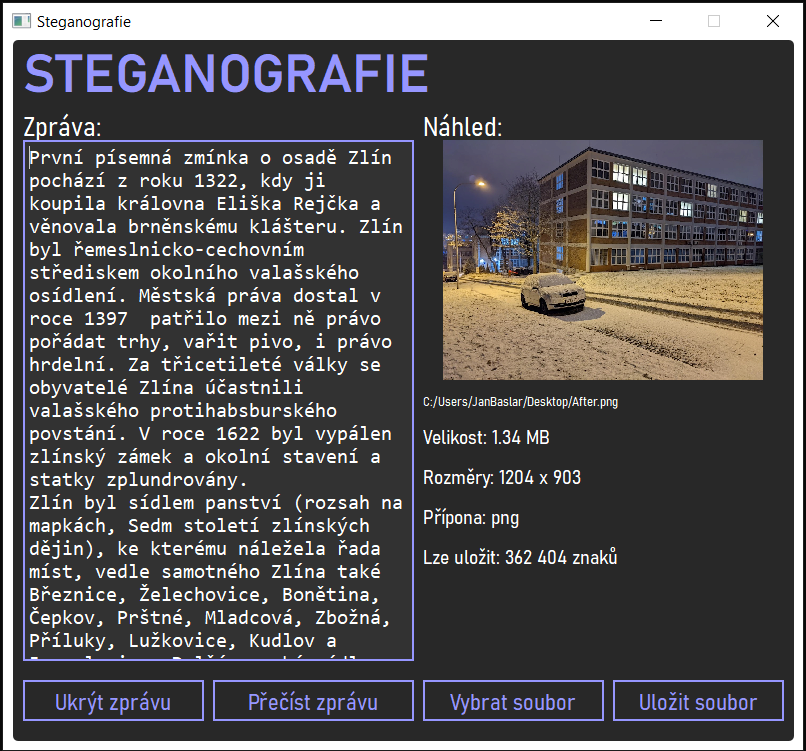

# Steganografie
Pythonovská desktopová aplikace, která ukládá zprávu do PNG nebo BMP souborů pomocí metody LSB (least significant bit). Každý znak převede na jeho binární hodnotu pomocí UTF-8 a uloží jej do složek R, G i B v každém pixelu. Jeden znak převádí na 9 bitů, kvůli podpoře češtiny. Jeden znak je teda šifrován ve třech pixelech. Aplikace umí načíst vybraný soubor, uložit zprávu a uložit soubor se zprávou v podporovaném formátu. Rovněž umí přečíst zprávu z obrázku uloženou stejným způsobem.

### Ukázka spuštěné aplikace

### Obrázek před a po uložení zprávy

